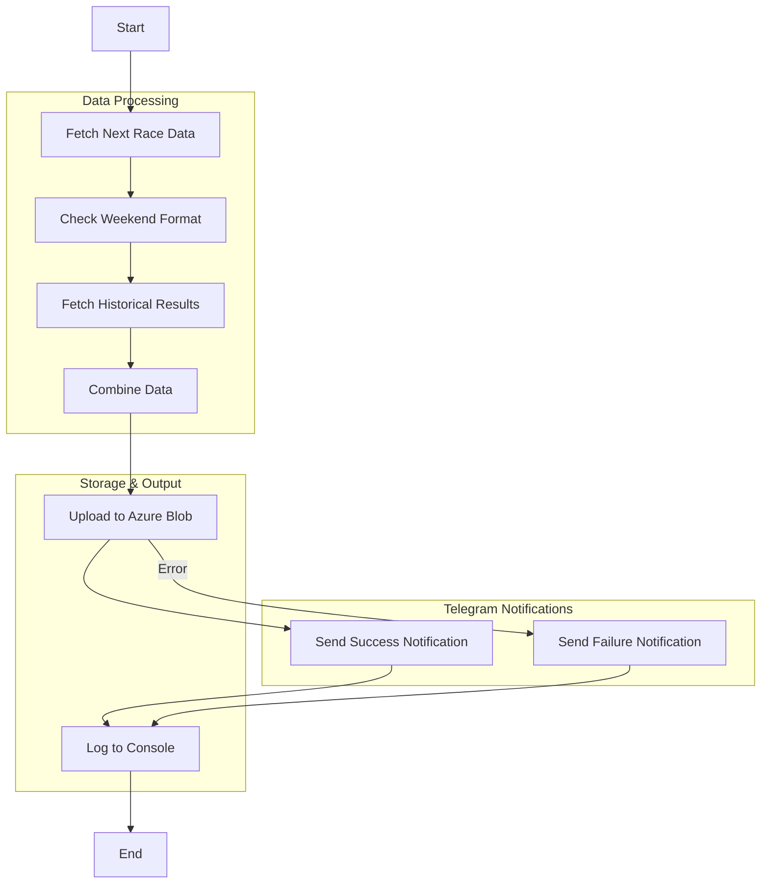

# F1 Next Race Info

A Node.js application that fetches Formula 1 race information from multiple APIs, processes it, and outputs detailed race data in JSON format. The application runs in a Docker container and provides information about the next F1 race, including session times, weekend format, and historical race results.

## Features

- Fetches next race details (circuit info, session times, location)
- Determines weekend format (regular/sprint)
- Collects historical race data (winners, finishers, safety car deployments, and red flags) for the last decade
- Outputs structured JSON data to Azure Blob Storage
- Logs the JSON output to the console
- Runs in a containerized environment

## Prerequisites

- Docker installed on your system
- Internet connection to access the F1 APIs
- An Azure Storage account and container

## Installation & Usage

1. Clone the repository:

```bash
git clone <repository-url>
cd f1-fantasy-next-race-info
```

2. Install dependencies:

```bash
npm install
```

3. Set up environment variables:

- Copy `.env.example` to `.env` and fill in your Azure Storage connection string and container name.

4. Build the Docker image:

```bash
docker build -t f1-fantasy-next-race-info .
```

5. Run the application:

```bash
docker run --rm --env-file .env f1-fantasy-next-race-info
```

The application will:

- Fetch data from all required APIs
- Process and combine the data
- Upload the output as `next-race-info.json` to your Azure Blob Storage container
- Print the formatted JSON to the console

## Azure Blob Storage Integration

- The output JSON is uploaded to Azure Blob Storage using the [`src/azureBlobStorageService.js`](src/azureBlobStorageService.js:1) module.
- The same JSON is also logged to the console for inspection or debugging.
- Required environment variables:
  - `AZURE_STORAGE_CONNECTION_STRING`
  - `AZURE_STORAGE_CONTAINER_NAME`
- See `.env.example` for the format.

## Telegram Log Channel Integration

- The app sends upload success/failure notifications to a Telegram log channel using a bot.
- Required environment variable:
  - `TELEGRAM_BOT_TOKEN` (add to your `.env` file)
- The log channel chat ID is hardcoded in [`src/telegramService.js`](src/telegramService.js).
- All messages sent to this log channel are automatically prefixed with `NEXT_RACE_INFO: `.
- If you use the Telegram service to send messages to other chat IDs, the prefix will not be added.
- The Telegram integration uses the [`node-telegram-bot-api`](https://www.npmjs.com/package/node-telegram-bot-api) package.

## API Endpoints Used

1. Next Race Data:
   ```
   https://api.jolpi.ca/ergast/f1/current/next.json
   ```
2. Sprint Weekend Check:
   ```
   https://api.jolpi.ca/ergast/f1/<season>/<round>/sprint.json
   ```
3. Historical Results:
   ```
   https://api.jolpi.ca/ergast/f1/{year}/circuits/{circuitId}/results.json
   ```

## Application Flow



## Output Format

The application generates a JSON file with the following structure (uploaded as `next-race-info.json`):

```json
{
  circuitId: "catalunya",
  raceName: "Spanish Grand Prix",
  round: 9,
  season: 2025,
  circuitName: "Circuit de Barcelona-Catalunya",
  location: {
    lat: "41.57",
    long: "2.26111",
    locality: "Montmeló",
    country: "Spain",
  },
  sessions: {
    firstPractice: "2025-05-30T11:30:00Z",
    secondPractice: "2025-05-30T15:00:00Z",
    thirdPractice: "2025-05-31T10:30:00Z",
    qualifying: "2025-05-31T14:00:00Z",
    race: "2025-06-01T13:00:00Z",
  },
  weekendFormat: "regular",
  historicalRaceStats: [
    {
      season: 2024,
      winner: "Max Verstappen",
      constructor: "Red Bull",
      carsFinished: 20,
      safetyCars: 0,
      redFlags: 0,
    },
    {
      season: 2023,
      winner: "Max Verstappen",
      constructor: "Red Bull",
      carsFinished: 20,
      safetyCars: 0,
      redFlags: 0,
    },
    {
      season: 2022,
      winner: "Max Verstappen",
      constructor: "Red Bull",
      carsFinished: 18,
    },
    {
      season: 2021,
      winner: "Lewis Hamilton",
      constructor: "Mercedes",
      carsFinished: 19,
    },
    {
      season: 2020,
      winner: "Lewis Hamilton",
      constructor: "Mercedes",
      carsFinished: 19,
    },
    {
      season: 2019,
      winner: "Lewis Hamilton",
      constructor: "Mercedes",
      carsFinished: 18,
    },
    {
      season: 2018,
      winner: "Lewis Hamilton",
      constructor: "Mercedes",
      carsFinished: 14,
    },
    {
      season: 2017,
      winner: "Lewis Hamilton",
      constructor: "Mercedes",
      carsFinished: 16,
    },
    {
      season: 2016,
      winner: "Max Verstappen",
      constructor: "Red Bull",
      carsFinished: 17,
    },
    {
      season: 2015,
      winner: "Nico Rosberg",
      constructor: "Mercedes",
      carsFinished: 18,
    },
  ],
  trackHistory: "The Circuit de Barcelona-Catalunya, located in Montmeló, Spain, was inaugurated on September 10, 1991, just ahead of its debut hosting the Spanish Grand Prix that same year. Its establishment coincided with preparations for the 1992 Barcelona Olympics, reflecting Spain’s growing investment in international sporting events. Since its introduction to the Formula 1 calendar, the circuit has become a mainstay, celebrated for its technical complexity and the crucial role it plays in pre-season testing due to its mix of long straights, high-speed corners, and slow technical sections. The circuit has undergone several notable modifications over the years, most significantly in 2007 with the addition of a slow chicane before the final corner to improve safety and overtaking possibilities, and later in 2023, when the original fast final two corners were reinstated, restoring a key challenge for drivers and increasing the speed on the main straight. Over the decades, the Spanish Grand Prix at this track has delivered numerous memorable moments, including Michael Schumacher’s heroic 1996 victory in torrential rain—widely regarded as one of his finest performances—and Fernando Alonso’s emotional win in 2006, becoming the first Spanish driver to win his home Grand Prix. The circuit has also been the scene of dramatic duels, such as the infamous collision between Nico Rosberg and Lewis Hamilton on the opening lap in 2016, which handed a maiden victory to Max Verstappen, making him the youngest race winner in F1 history at just 18. Its high-speed layout, taxing on tires and aerodynamics, has made it a proving ground for both cars and drivers, with legends like Ayrton Senna, Alain Prost, and Nigel Mansell all experiencing memorable battles here. The Circuit de Barcelona-Catalunya remains historically significant for its continuous influence on vehicle development and its role as a venue where champions are both tested and made.",
}
```

Note: The `sessions` object only includes sessions that are scheduled for the race weekend. Sessions that don't exist for a particular weekend format are omitted from the output rather than showing as null.

### Example Output

Here's an example output for the Monaco Grand Prix:

```json
{
  "circuitId": "catalunya",
  "raceName": "Spanish Grand Prix",
  "round": 9,
  "season": 2025,
  "circuitName": "Circuit de Barcelona-Catalunya",
  "location": {
    "lat": "41.57",
    "long": "2.26111",
    "locality": "Montmeló",
    "country": "Spain"
  },
  "sessions": {
    "firstPractice": "2025-05-30T11:30:00Z",
    "secondPractice": "2025-05-30T15:00:00Z",
    "thirdPractice": "2025-05-31T10:30:00Z",
    "qualifying": "2025-05-31T14:00:00Z",
    "race": "2025-06-01T13:00:00Z"
  },
  "weekendFormat": "regular",
  "historicalRaceStats": [
    {
      "season": 2024,
      "winner": "Max Verstappen",
      "constructor": "Red Bull",
      "carsFinished": 20,
      "safetyCars": 0,
      "redFlags": 0
    },
    {
      "season": 2023,
      "winner": "Max Verstappen",
      "constructor": "Red Bull",
      "carsFinished": 20,
      "safetyCars": 0,
      "redFlags": 0
    },
    {
      "season": 2022,
      "winner": "Max Verstappen",
      "constructor": "Red Bull",
      "carsFinished": 18
    },
    {
      "season": 2021,
      "winner": "Lewis Hamilton",
      "constructor": "Mercedes",
      "carsFinished": 19
    },
    {
      "season": 2020,
      "winner": "Lewis Hamilton",
      "constructor": "Mercedes",
      "carsFinished": 19
    },
    {
      "season": 2019,
      "winner": "Lewis Hamilton",
      "constructor": "Mercedes",
      "carsFinished": 18
    },
    {
      "season": 2018,
      "winner": "Lewis Hamilton",
      "constructor": "Mercedes",
      "carsFinished": 14
    },
    {
      "season": 2017,
      "winner": "Lewis Hamilton",
      "constructor": "Mercedes",
      "carsFinished": 16
    },
    {
      "season": 2016,
      "winner": "Max Verstappen",
      "constructor": "Red Bull",
      "carsFinished": 17
    },
    {
      "season": 2015,
      "winner": "Nico Rosberg",
      "constructor": "Mercedes",
      "carsFinished": 18
    }
  ]
}
```

## Project Structure

- `index.js` - Main application logic
- `src/azureBlobStorageService.js` - Azure Blob Storage upload logic
- `src/f1DataService.js` - F1 data fetching and processing
  - Includes `fetchRaceInterruptionData` for safety car and red flag statistics
- `package.json` - Project configuration
- `Dockerfile` - Container configuration
- `.dockerignore` - Docker build exclusions
- `.env.example` - Example environment variable file

## Error Handling

The application includes basic error handling for:

- Failed API requests
- Missing or invalid data in API responses
- Azure Blob Storage upload errors

If an error occurs, the application will:

1. Log the error to the console
2. Exit with status code 1

## Development

To modify the application:

1. Update the source code in `index.js` or `src/azureBlobStorageService.js`
2. Rebuild the Docker image:

```bash
docker build -t f1-fantasy-next-race-info .
```

3. Run the container to test your changes:

```bash
docker run --rm --env-file .env f1-fantasy-next-race-info
```

## License

ISC

## Contributing

Feel free to submit issues and enhancement requests!
