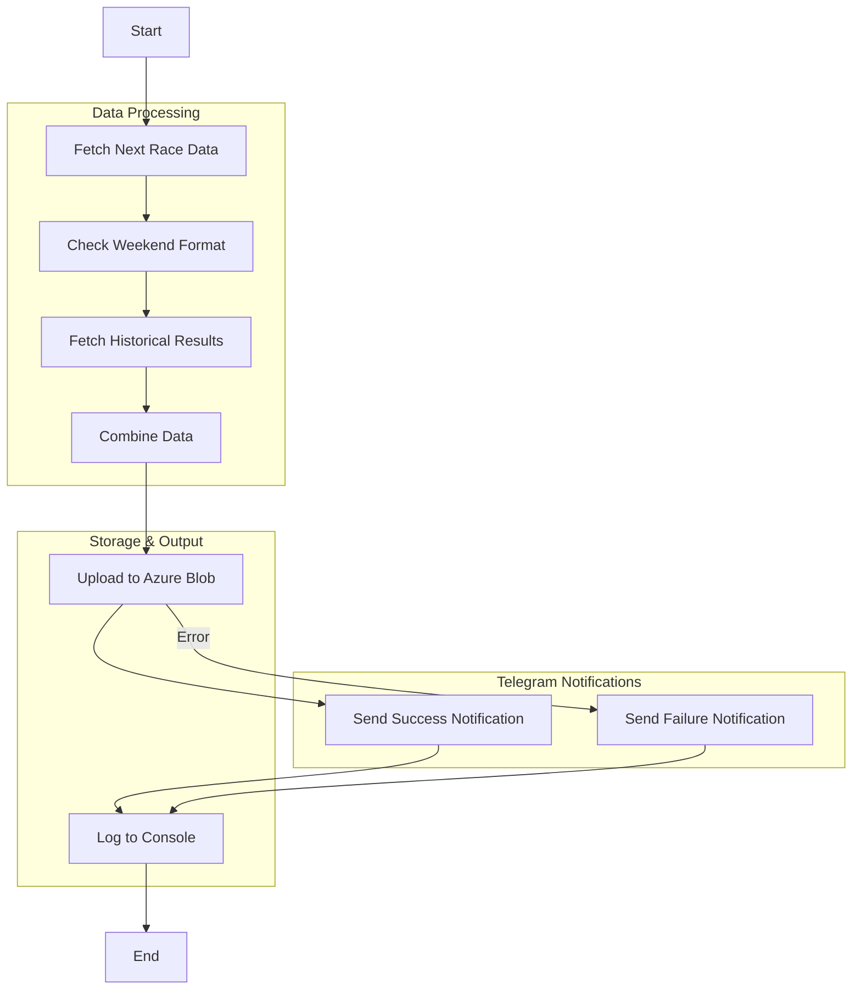

# F1 Next Race Info

A Node.js application that fetches Formula 1 race information from multiple APIs, processes it, and outputs detailed race data in JSON format. The application runs in a Docker container and provides information about the next F1 race, including session times, weekend format, and historical race results.

## Features

- Fetches next race details (circuit info, session times, location)
- Determines weekend format (regular/sprint)
- Collects historical race data (winners, finishers, safety car deployments, red flags, and overtakes) for the last decade
- Integrates overtake data from external Google Sheets source
- Outputs structured JSON data to Azure Blob Storage
- Logs the JSON output to the console
- Runs in a containerized environment

## Prerequisites

- Docker installed on your system
- Internet connection to access the F1 APIs
- An Azure Storage account and container

## Installation & Usage

1. Clone the repository:

```bash
git clone <repository-url>
cd f1-fantasy-next-race-info
```

2. Install dependencies:

```bash
npm install
```

3. Set up environment variables:

- Copy `.env.example` to `.env` and fill in your Azure Storage connection string and container name.

4. Build the Docker image:

```bash
docker build -t f1-fantasy-next-race-info .
```

5. Run the application:

```bash
docker run --rm --env-file .env f1-fantasy-next-race-info
```

The application will:

- Fetch data from all required APIs
- Process and combine the data
- Upload the output as `next-race-info.json` to your Azure Blob Storage container
- Print the formatted JSON to the console

## Azure Blob Storage Integration

- The output JSON is uploaded to Azure Blob Storage using the [`src/azureBlobStorageService.js`](src/azureBlobStorageService.js:1) module.
- The same JSON is also logged to the console for inspection or debugging.
- Required environment variables:
  - `AZURE_STORAGE_CONNECTION_STRING`
  - `AZURE_STORAGE_CONTAINER_NAME`
- See `.env.example` for the format.

## Telegram Log Channel Integration

- The app sends upload success/failure notifications to a Telegram log channel using a bot.
- Required environment variable:
  - `TELEGRAM_BOT_TOKEN` (add to your `.env` file)
- The log channel chat ID is hardcoded in [`src/telegramService.js`](src/telegramService.js).
- All messages sent to this log channel are automatically prefixed with `NEXT_RACE_INFO: `.
- If you use the Telegram service to send messages to other chat IDs, the prefix will not be added.
- The Telegram integration uses the [`node-telegram-bot-api`](https://www.npmjs.com/package/node-telegram-bot-api) package.

## Overtake Data Integration

The application integrates overtake statistics from an external Google Sheets data source to enhance historical race analysis.

### How It Works

1. **Race Name Mapping**: The [`src/raceNameMapping.js`](src/raceNameMapping.js) module provides a static mapping between race names from the Jolpi.ca API (e.g., "Italian Grand Prix") and the corresponding names in the Google Sheet (e.g., "Italy").

2. **Data Fetching**: The [`fetchOvertakeData()`](src/f1DataService.js) function fetches overtake data directly from the Google Sheet in CSV format and parses it to find matching year and race combinations.

3. **Integration**: Overtake counts are automatically included in the historical race statistics alongside existing data (winners, constructors, safety cars, red flags, etc.).

### Supported Race Mappings

The mapping includes 30+ races covering:

- **European Races**: Italian GP → Italy, British GP → Great Britain, Spanish GP → Spain, etc.
- **Americas**: United States GP → USA, Brazilian GP → Brazil, Canadian GP → Canada, etc.
- **Asia-Pacific**: Japanese GP → Japan, Australian GP → Australia, Singapore GP → Singapore, etc.
- **Special Cases**: Styrian GP → Austria, Emilia Romagna GP → Emilia-Romagna, etc.

### Error Handling

- Graceful handling when overtake data is unavailable for specific races/years
- Robust CSV parsing with proper handling of quoted fields
- Network error resilience with warning logs for debugging

## API Endpoints Used

1. Next Race Data:
   ```
   https://api.jolpi.ca/ergast/f1/current/next.json
   ```
2. Sprint Weekend Check:
   ```
   https://api.jolpi.ca/ergast/f1/<season>/<round>/sprint.json
   ```
3. Historical Results:
   ```
   https://api.jolpi.ca/ergast/f1/{year}/circuits/{circuitId}/results.json
   ```
4. Overtake Data:
   ```
   https://docs.google.com/spreadsheets/d/1XueNI7ZawEX0RLDq5dAGVqsEb1-DBOK2kUWGwM1OMKs/export?format=csv
   ```

## Application Flow



## Output Format

The application generates a JSON file with the following structure (uploaded as `next-race-info.json`):

```json
{
  "circuitId": "catalunya",
  "raceName": "Spanish Grand Prix",
  "round": 9,
  "season": 2025,
  "circuitName": "Circuit de Barcelona-Catalunya",
  "location": {
    "lat": "41.57",
    "long": "2.26111",
    "locality": "Montmeló",
    "country": "Spain"
  },
  "sessions": {
    "firstPractice": "2025-05-30T11:30:00Z",
    "secondPractice": "2025-05-30T15:00:00Z",
    "thirdPractice": "2025-05-31T10:30:00Z",
    "qualifying": "2025-05-31T14:00:00Z",
    "race": "2025-06-01T13:00:00Z"
  },
  "weekendFormat": "regular",
  "historicalRaceStats": [
    {
      "season": 2024,
      "winner": "Max Verstappen",
      "constructor": "Red Bull",
      "carsFinished": 20,
      "safetyCars": 0,
      "redFlags": 0,
      "overtakes": 55
    },
    {
      "season": 2023,
      "winner": "Max Verstappen",
      "constructor": "Red Bull",
      "carsFinished": 20,
      "safetyCars": 0,
      "redFlags": 0,
      "overtakes": 65
    },
    {
      "season": 2022,
      "winner": "Max Verstappen",
      "constructor": "Red Bull",
      "carsFinished": 18,
      "overtakes": 48
    },
    {
      "season": 2021,
      "winner": "Lewis Hamilton",
      "constructor": "Mercedes",
      "carsFinished": 19,
      "overtakes": 51
    },
    {
      "season": 2020,
      "winner": "Lewis Hamilton",
      "constructor": "Mercedes",
      "carsFinished": 19,
      "overtakes": 32
    },
    {
      "season": 2019,
      "winner": "Lewis Hamilton",
      "constructor": "Mercedes",
      "carsFinished": 18,
      "overtakes": 26
    },
    {
      "season": 2018,
      "winner": "Lewis Hamilton",
      "constructor": "Mercedes",
      "carsFinished": 14,
      "overtakes": 13
    },
    {
      "season": 2017,
      "winner": "Lewis Hamilton",
      "constructor": "Mercedes",
      "carsFinished": 16,
      "overtakes": 20
    },
    {
      "season": 2016,
      "winner": "Max Verstappen",
      "constructor": "Red Bull",
      "carsFinished": 17,
      "overtakes": 54
    },
    {
      "season": 2015,
      "winner": "Nico Rosberg",
      "constructor": "Mercedes",
      "carsFinished": 18,
      "overtakes": 30
    }
  ],
  "trackHistory": "The Circuit de Barcelona-Catalunya, situated in Montmeló, Spain, was inaugurated on September 10, 1991, and has since served as the primary venue for the Spanish Grand Prix in Formula 1. Designed with input from renowned circuit architect Hermann Tilke (for later revisions) and Spanish engineer Josep Casanovas, the circuit’s original 4.747-kilometer layout swiftly replaced Jerez as the home of the Spanish Grand Prix from 1991 onward. One of the most significant modifications came in 2007, when a tight chicane was added before the final corner in an effort to enhance overtaking opportunities and improve safety, fundamentally altering the approach to the main straight. The track’s technical combination of high- and low-speed corners, along with its abrasive surface, has made it a critical venue for pre-season testing, shaping car development and strategy over decades. The circuit’s storied history includes the rain-soaked 1996 Spanish Grand Prix, where a young Michael Schumacher claimed his first Ferrari victory in a masterful display, and the infamous 2016 race that saw Mercedes teammates Lewis Hamilton and Nico Rosberg collide on the opening lap, paving the way for Max Verstappen to become the youngest-ever F1 race winner at just 18 years old. Legendary figures such as Ayrton Senna, Mika Hakkinen, Fernando Alonso—who electrified home crowds with a stunning victory in 2006—and Lewis Hamilton have all left their mark here. Its long, sweeping corners, particularly Turn 3 (Renault), test driver skill and car balance, establishing the circuit as a historical benchmark for technical excellence and racing drama in Formula 1."
}
```

Note: The `sessions` object only includes sessions that are scheduled for the race weekend. Sessions that don't exist for a particular weekend format are omitted from the output rather than showing as null.

### Example Output

Here's an example output for the Monaco Grand Prix:

```json
{
  "circuitId": "catalunya",
  "raceName": "Spanish Grand Prix",
  "round": 9,
  "season": 2025,
  "circuitName": "Circuit de Barcelona-Catalunya",
  "location": {
    "lat": "41.57",
    "long": "2.26111",
    "locality": "Montmeló",
    "country": "Spain"
  },
  "sessions": {
    "firstPractice": "2025-05-30T11:30:00Z",
    "secondPractice": "2025-05-30T15:00:00Z",
    "thirdPractice": "2025-05-31T10:30:00Z",
    "qualifying": "2025-05-31T14:00:00Z",
    "race": "2025-06-01T13:00:00Z"
  },
  "weekendFormat": "regular",
  "historicalRaceStats": [
    {
      "season": 2024,
      "winner": "Max Verstappen",
      "constructor": "Red Bull",
      "carsFinished": 20,
      "safetyCars": 0,
      "redFlags": 0
    },
    {
      "season": 2023,
      "winner": "Max Verstappen",
      "constructor": "Red Bull",
      "carsFinished": 20,
      "safetyCars": 0,
      "redFlags": 0
    },
    {
      "season": 2022,
      "winner": "Max Verstappen",
      "constructor": "Red Bull",
      "carsFinished": 18
    },
    {
      "season": 2021,
      "winner": "Lewis Hamilton",
      "constructor": "Mercedes",
      "carsFinished": 19
    },
    {
      "season": 2020,
      "winner": "Lewis Hamilton",
      "constructor": "Mercedes",
      "carsFinished": 19
    },
    {
      "season": 2019,
      "winner": "Lewis Hamilton",
      "constructor": "Mercedes",
      "carsFinished": 18
    },
    {
      "season": 2018,
      "winner": "Lewis Hamilton",
      "constructor": "Mercedes",
      "carsFinished": 14
    },
    {
      "season": 2017,
      "winner": "Lewis Hamilton",
      "constructor": "Mercedes",
      "carsFinished": 16
    },
    {
      "season": 2016,
      "winner": "Max Verstappen",
      "constructor": "Red Bull",
      "carsFinished": 17
    },
    {
      "season": 2015,
      "winner": "Nico Rosberg",
      "constructor": "Mercedes",
      "carsFinished": 18
    }
  ]
}
```

## Project Structure

- `index.js` - Main application logic
- `src/azureBlobStorageService.js` - Azure Blob Storage upload logic
- `src/f1DataService.js` - F1 data fetching and processing
  - Includes `fetchRaceInterruptionData` for safety car and red flag statistics
  - Includes `fetchOvertakeData` for overtake statistics from Google Sheets
- `src/raceNameMapping.js` - Race name mapping between Jolpi.ca and Google Sheets format
- `package.json` - Project configuration
- `Dockerfile` - Container configuration
- `.dockerignore` - Docker build exclusions
- `.env.example` - Example environment variable file

## Error Handling

The application includes basic error handling for:

- Failed API requests
- Missing or invalid data in API responses
- Azure Blob Storage upload errors

If an error occurs, the application will:

1. Log the error to the console
2. Exit with status code 1

## Development

To modify the application:

1. Update the source code in `index.js` or `src/azureBlobStorageService.js`
2. Rebuild the Docker image:

```bash
docker build -t f1-fantasy-next-race-info .
```

3. Run the container to test your changes:

```bash
docker run --rm --env-file .env f1-fantasy-next-race-info
```

## License

ISC

## Contributing

Feel free to submit issues and enhancement requests!
