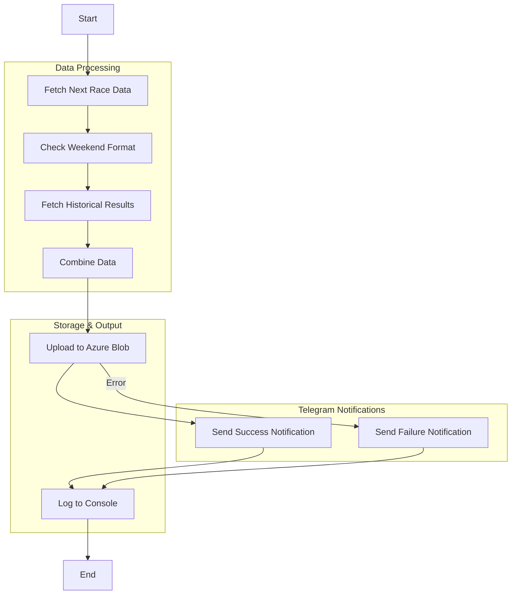

# F1 Next Race Info

A Node.js application that fetches Formula 1 race information from multiple APIs, processes it, and outputs detailed race data in JSON format. The application runs in a Docker container and provides information about the next F1 race, including session times, weekend format, and historical race results.

## Features

- Fetches next race details (circuit info, session times, location)
- Determines weekend format (regular/sprint)
- Collects historical race data (winners and finishers) for the last decade
- Outputs structured JSON data to Azure Blob Storage
- Logs the JSON output to the console
- Runs in a containerized environment

## Prerequisites

- Docker installed on your system
- Internet connection to access the F1 APIs
- An Azure Storage account and container

## Installation & Usage

1. Clone the repository:

```bash
git clone <repository-url>
cd f1-fantasy-next-race-info
```

2. Install dependencies:

```bash
npm install
```

3. Set up environment variables:

- Copy `.env.example` to `.env` and fill in your Azure Storage connection string and container name.

4. Build the Docker image:

```bash
docker build -t f1-fantasy-next-race-info .
```

5. Run the application:

```bash
docker run --rm --env-file .env f1-fantasy-next-race-info
```

The application will:

- Fetch data from all required APIs
- Process and combine the data
- Upload the output as `next-race-info.json` to your Azure Blob Storage container
- Print the formatted JSON to the console

## Azure Blob Storage Integration

- The output JSON is uploaded to Azure Blob Storage using the [`src/azureBlobStorageService.js`](src/azureBlobStorageService.js:1) module.
- The same JSON is also logged to the console for inspection or debugging.
- Required environment variables:
  - `AZURE_STORAGE_CONNECTION_STRING`
  - `AZURE_STORAGE_CONTAINER_NAME`
- See `.env.example` for the format.

## Telegram Log Channel Integration

- The app sends upload success/failure notifications to a Telegram log channel using a bot.
- Required environment variable:
  - `TELEGRAM_BOT_TOKEN` (add to your `.env` file)
- The log channel chat ID is hardcoded in [`src/telegramService.js`](src/telegramService.js).
- All messages sent to this log channel are automatically prefixed with `NEXT_RACE_INFO: `.
- If you use the Telegram service to send messages to other chat IDs, the prefix will not be added.
- The Telegram integration uses the [`node-telegram-bot-api`](https://www.npmjs.com/package/node-telegram-bot-api) package.

## API Endpoints Used

1. Next Race Data:
   ```
   https://api.jolpi.ca/ergast/f1/current/next.json
   ```
2. Sprint Weekend Check:
   ```
   https://api.jolpi.ca/ergast/f1/<season>/<round>/sprint.json
   ```
3. Historical Results:
   ```
   https://api.jolpi.ca/ergast/f1/{year}/circuits/{circuitId}/results.json
   ```

## Application Flow



## Output Format

The application generates a JSON file with the following structure (uploaded as `next-race-info.json`):

```json
{
  "circuitId": "string",
  "raceName": "string",
  "round": number,
  "season": number,
  "circuitName": "string",
  "location": {
    "lat": "string",
    "long": "string",
    "locality": "string",
    "country": "string"
  },
  "sessions": {
    "firstPractice": "ISO-8601 datetime string",
    "qualifying": "ISO-8601 datetime string",
    "race": "ISO-8601 datetime string"
    // Optional sessions (only included when applicable):
    // "secondPractice": "ISO-8601 datetime string",
    // "thirdPractice": "ISO-8601 datetime string",
    // "sprint": "ISO-8601 datetime string",
    // "sprintQualifying": "ISO-8601 datetime string"
  },
  "weekendFormat": "regular" | "sprint",
  "historicalData": [
    {
      "season": number,
      "winner": "string",
      "carsFinished": number
    }
  ]
}
```

Note: The `sessions` object only includes sessions that are scheduled for the race weekend. Sessions that don't exist for a particular weekend format are omitted from the output rather than showing as null.

### Example Output

Here's an example output for the Monaco Grand Prix:

```json
{
  "circuitId": "monaco",
  "raceName": "Monaco Grand Prix",
  "round": 8,
  "season": 2025,
  "circuitName": "Circuit de Monaco",
  "location": {
    "lat": "43.7347",
    "long": "7.42056",
    "locality": "Monte-Carlo",
    "country": "Monaco"
  },
  "sessions": {
    "firstPractice": "2025-05-23T11:30:00Z",
    "secondPractice": "2025-05-23T15:00:00Z",
    "thirdPractice": "2025-05-24T10:30:00Z",
    "qualifying": "2025-05-24T14:00:00Z",
    "race": "2025-05-25T13:00:00Z"
  },
  "weekendFormat": "regular",
  "historicalData": [
    {
      "season": 2015,
      "winner": "Nico Rosberg",
      "carsFinished": 17
    },
    {
      "season": 2016,
      "winner": "Lewis Hamilton",
      "carsFinished": 15
    },
    {
      "season": 2017,
      "winner": "Sebastian Vettel",
      "carsFinished": 13
    },
    {
      "season": 2018,
      "winner": "Daniel Ricciardo",
      "carsFinished": 17
    },
    {
      "season": 2019,
      "winner": "Lewis Hamilton",
      "carsFinished": 19
    },
    {
      "season": 2021,
      "winner": "Max Verstappen",
      "carsFinished": 18
    },
    {
      "season": 2022,
      "winner": "Sergio Pérez",
      "carsFinished": 17
    },
    {
      "season": 2023,
      "winner": "Max Verstappen",
      "carsFinished": 19
    },
    {
      "season": 2024,
      "winner": "Charles Leclerc",
      "carsFinished": 16
    }
  ]
}
```

## Project Structure

- `index.js` - Main application logic
- `src/azureBlobStorageService.js` - Azure Blob Storage upload logic
- `src/f1DataService.js` - F1 data fetching and processing
- `package.json` - Project configuration
- `Dockerfile` - Container configuration
- `.dockerignore` - Docker build exclusions
- `.env.example` - Example environment variable file

## Error Handling

The application includes basic error handling for:

- Failed API requests
- Missing or invalid data in API responses
- Azure Blob Storage upload errors

If an error occurs, the application will:

1. Log the error to the console
2. Exit with status code 1

## Development

To modify the application:

1. Update the source code in `index.js` or `src/azureBlobStorageService.js`
2. Rebuild the Docker image:

```bash
docker build -t f1-fantasy-next-race-info .
```

3. Run the container to test your changes:

```bash
docker run --rm --env-file .env f1-fantasy-next-race-info
```

## License

ISC

## Contributing

Feel free to submit issues and enhancement requests!
