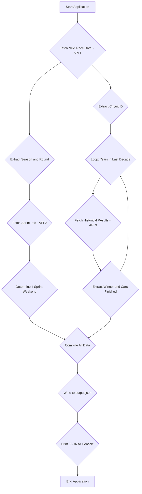

# Project Plan: F1 Next Race Info Docker Application

**Objective:** Create a Node.js application, containerized with Docker, that fetches Formula 1 race data from multiple APIs, processes it, saves it to a JSON file, and prints the JSON to the console.

**I. Project Setup & Configuration:**

1.  **Initialize Node.js Project:**
    *   Create a `package.json` file.
        *   Specify Node.js version compatibility (targeting LTS 20.x).
        *   Initially, no external npm packages are required as we'll use the built-in `fetch` API.
2.  **Application File:**
    *   Create the main application file: `index.js`.
3.  **Output File:**
    *   The application will generate `output.json` in the project root.
4.  **Docker Configuration:**
    *   Create a `Dockerfile` using `node:20-alpine` as the base image.
    *   Create a `.dockerignore` file to exclude unnecessary files (e.g., `node_modules`, `output.json`, `.git`) from the Docker image.

**II. Application Logic in `index.js`:**

1.  **Fetch Next Race Details (API 1):**
    *   **Endpoint:** `https://api.jolpi.ca/ergast/f1/current/next.json`
    *   **Data to Extract:**
        *   `circuitId`
        *   `raceName`
        *   `round` (store for API 2)
        *   `season` (store for API 2 - typically the current year from the response)
        *   `circuitName`
        *   `Location` (likely an object with `lat`, `long`, `locality`, `country`)
        *   Session Times (combine `date` and `time` fields from nested objects):
            *   `FirstPractice`
            *   `SecondPractice`
            *   `ThirdPractice`
            *   `Sprint` (if available)
            *   `SprintQualifying` (if available)
            *   `Qualifying`
            *   `Race`
    *   Handle cases where certain sessions (e.g., `Sprint`, `ThirdPractice`) might not be present for all race weekends.

2.  **Determine Sprint Weekend (API 2):**
    *   **Endpoint:** `https://api.jolpi.ca/ergast/f1/<season>/<round>/sprint.json` (using `season` and `round` from API 1).
    *   **Logic:**
        *   If the `Races` array in the response is not empty, then `isSprintWeekend = true`.
        *   Otherwise, `isSprintWeekend = false`.

3.  **Fetch Historical Circuit Data (API 3):**
    *   Use `circuitId` obtained from API 1.
    *   **Years:** Iterate through a rolling 10-year window (current year - 10 to current year - 1). For example, if running in 2025, fetch data for 2015, 2016, ..., 2024.
    *   For each year in the range:
        *   **Endpoint:** `https://api.jolpi.ca/ergast/f1/{year}/circuits/{circuitId}/results.json`
        *   **Data to Extract per Year:**
            *   **Winner:** From `Results[0].Driver` object (likely need `givenName` and `familyName`).
            *   **Cars Finished:** Count entries in the `Results` array where the `status` field indicates race completion (e.g., "Finished", "+1 Lap", "+2 Laps", etc.).

4.  **Data Aggregation:**
    *   Compile all fetched and processed data into the following JSON structure:
        ```json
        {
          "nextRace": {
            "circuitId": "...",
            "raceName": "...",
            "round": "...",
            "season": "...",
            "circuitName": "...",
            "location": { ... },
            "isSprintWeekend": true/false,
            "sessions": {
              "firstPractice": "YYYY-MM-DDTHH:mm:ssZ", // Combined and formatted
              "secondPractice": "...",
              "thirdPractice": "..." // (null or omitted if not applicable)
              "sprintQualifying": "..." // (null or omitted if not applicable)
              "sprint": "..." // (null or omitted if not applicable)
              "qualifying": "...",
              "race": "..."
            }
          },
          "historicalData": {
            "circuitId": "...", // Same as nextRace.circuitId
            "resultsByYear": [
              {
                "year": 2023, // Example
                "winner": "Driver Name",
                "carsFinished": 18
              }
              // ... other years ...
            ]
          }
        }
        ```

5.  **File Output and Console Logging:**
    *   Write the aggregated JSON object to `output.json` in the project root.
    *   Print the stringified JSON content to the console.

6.  **Error Handling:**
    *   Implement basic error handling for `fetch` requests (e.g., check `response.ok`, catch network errors).
    *   Log errors to the console.

**III. Dockerfile Implementation (`Dockerfile`):**

```dockerfile
# Use Node.js 20-alpine as the base image
FROM node:20-alpine

# Set the working directory in the container
WORKDIR /usr/src/app

# Copy package.json and package-lock.json (if available)
COPY package*.json ./

# Install app dependencies (if any were added in package.json)
# For now, this might not install anything if no dependencies are listed
# but it's good practice for future scalability.
RUN npm install --omit=dev

# Copy application source code
COPY . .

# Command to run the application
CMD ["node", "index.js"]
```

**IV. `.dockerignore` File (`.dockerignore`):**

```
node_modules
npm-debug.log
Dockerfile
.dockerignore
.git
.gitignore
README.md
output.json
```

**V. Workflow Diagram:**

